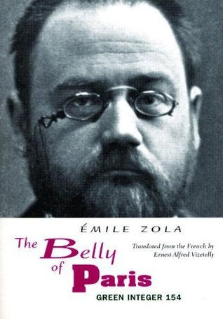
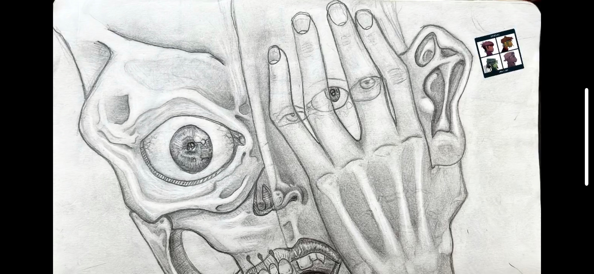
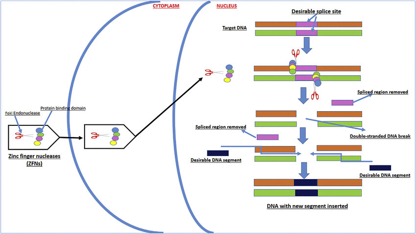
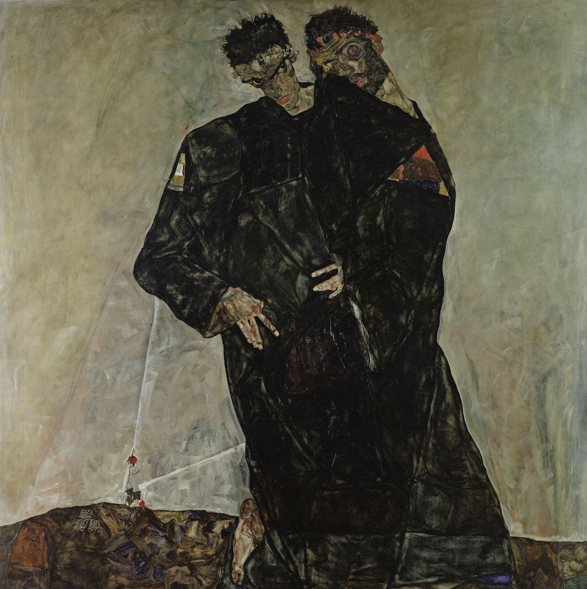

## About Me

My name is [Joe Borri](https://github.com/jborri/), a Graduate Student at CUNY Graduate Center. I am currently enrolled in the Data Analysis and Visualization Program. A few of my interests include:

- Reading novels and writing poetry
    - I am currently reading *The Belly of Paris* by Émile Zola
    - 
- Drawing and painting
    - My favorite **media** to work in are: *watercolors*, *charcoal*, *graphite*, and *acrylics*
    - 
- Biochemistry
    - Particularly biochemical pathways related to protein synthesis and gene editing.
    - 
- Going to Museums 
    - My favorite artist at the moment is **Egon Shiele**
    - 
